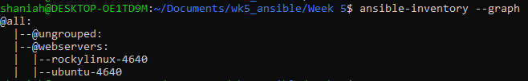

1) Create Two Droplets in DigitalOcean - one should be Rocky 8/9 and one should be Ubuntu 22.04. Please add 'web' as a tag to each droplet

2) Please ensure that you create an SSH key pair so that the machines can be accessed via SSH

2) On the host, create a working directory in WSL - this will be where you create the ansible files

3) Initialize this directory as a git repo and create a git ignore file to ignore keys

4) Set up ansible configuration file like so: 
```
[defaults]
host_key_checking = False
inventory = inventory
private_key_file = ubuntu_4640

[inventory]
enabled_plugins = community.digitalocean.digitalocean
```

5) Create an inventory folder with a file called hosts.digitalocean.yml, this is the basic configuration with the droplets' tags added:
```
plugin: community.digitalocean.digitalocean
attributes:
  - id
  - name
  - memory
  - vcpus
  - disk
  - size
  - image
  - networks
  - volume_ids
  - tags
  - region
groups:
  webservers: "'web' in (do_tags)"
compose:
  ansible_host: do_networks.v4 | selectattr('type','eq','public')
    | map(attribute='ip_address') | first
```

Here's a screenshot that I have two servers setup:


6) Create a regular user by creating a yaml file called new_user.yml and be sure to:
- give the user a name
- pick bin/bash as their shell
- give them sudo/wheel access
- state their home directory
- copy the root user's .ssh folder into the new user's home directory
- assign ownership to the new user in their home directory so that they can ssh in
- add authorized keys file to the new user's .ssh folder

7) Make sure to remove root ssh access to the VMs so now you'll only be accessing them through your new user
    - ``` sudo vi /etc/ssh/sshd_config ```
    - replace PermitRootLogin yes to PermitRootLogin no
    - ``` sudo systemctl restart sshd ```

8) Create another file called podman.yml to install podman and run a container. Be sure to do the following:
- use apt when installing podman on Ubuntu
- use yum when installing podman on Rocky
- pull and run container with the following: ``` - name: Pulling container
                 podman_image:
                    name: docker.io/httpd
                    tag: 2-alpine
                    ```
- to test that your container is runing, connect to your server via ssh and run ``` podman ps ```
